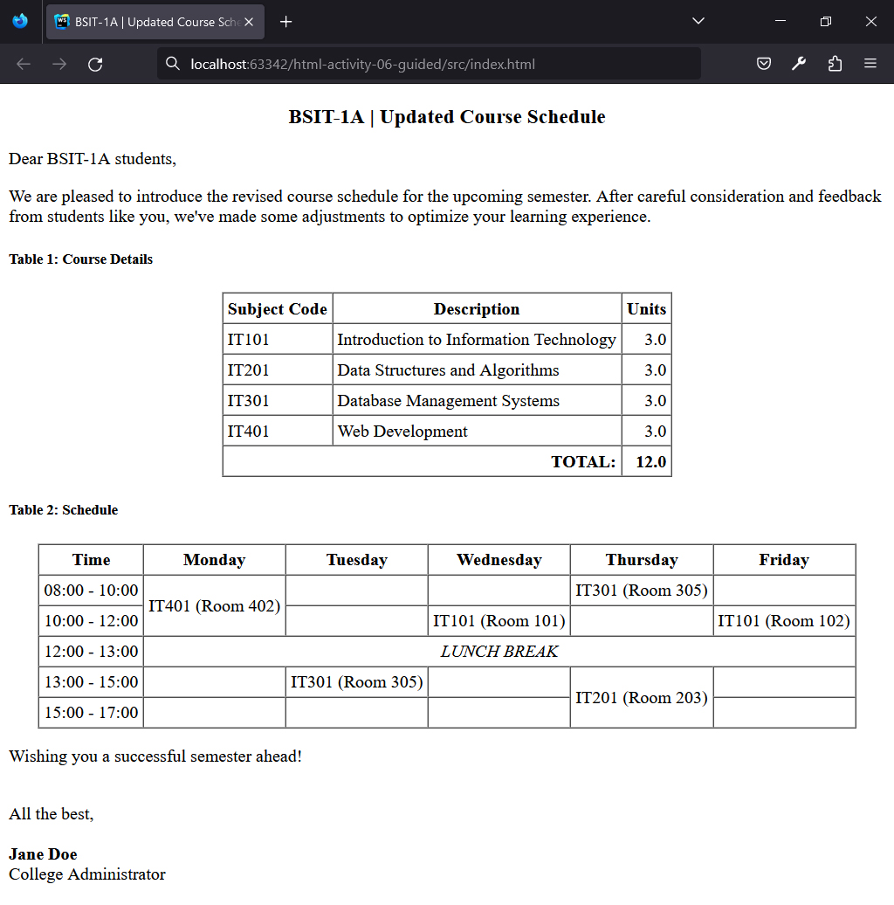
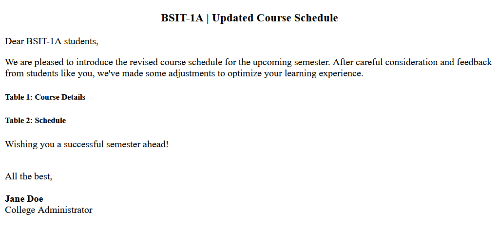
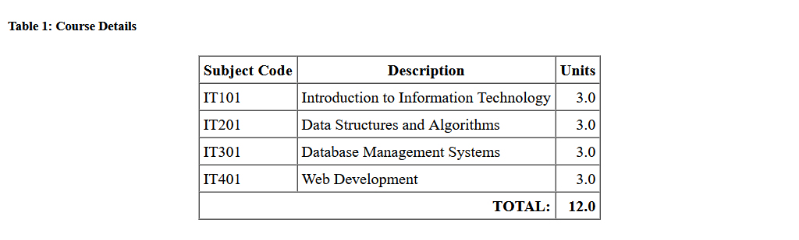
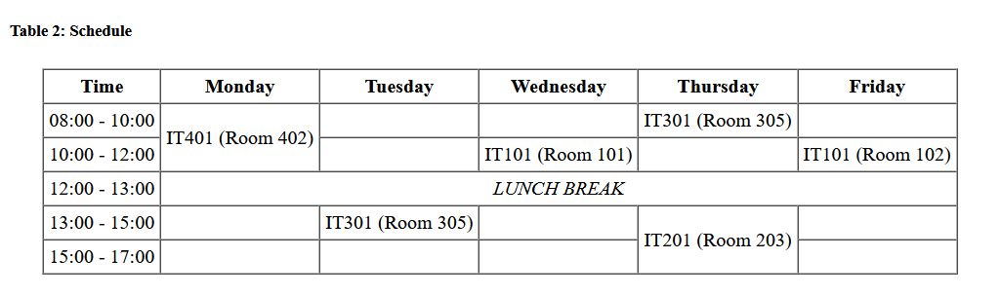
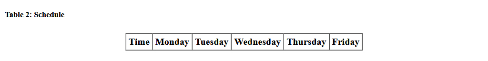
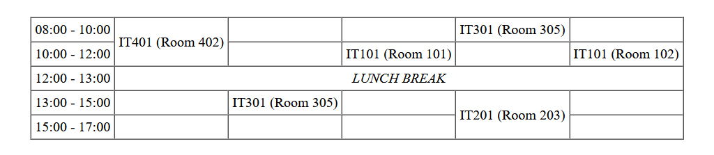

## HTML | Activity #6 (Guided): Tables
In this activity, we will create a **Course Announcement Page** with the following content:




### Development Setup
Create your `index.html` file inside the [**src**](/src) folder in this project,
then follow along with this guide.

To test your output, simply open it in your preferred web browser.


### Template
First, we need a regular HTML template that already contains the headers and paragraphs.



We will leave [comments](https://www.w3schools.com/html/html_comments.asp) for the parts that we will do later.

```html
<!DOCTYPE html>
<html lang="en">
<head>
    <meta charset="UTF-8">
    <title>BSIT-1A | Updated Course Schedule</title>
</head>
<body>
    <div class="header">
        <h3 align="center">
            BSIT-1A | Updated Course Schedule
        </h3>
        <p>
            Dear BSIT-1A students,
        </p>
        <p>
            We are pleased to introduce the revised course schedule for the upcoming semester.
            After careful consideration and feedback from students like you,
            we've made some adjustments to optimize your learning experience.
        </p>
    </div>

    <div class="course-details">
        <h5>Table 1: Course Details</h5>
        <div align="center">

            <!-- Course Details Table -->

        </div>
    </div>

    <div class="schedule">
        <h5>Table 2: Schedule</h5>
        <div align="center">

            <!-- Schedule Table -->

        </div>
    </div>

    <div class="footer">
        <p>Wishing you a successful semester ahead!</p>
        <p>
            <br/>
            All the best,
            <br/><br/>
            <b>Jane Doe</b>
            <br>
            College Administrator
        </p>
    </div>
</body>
</html>
```


### Course Details Table
A table is made up of **rows** and **columns**.



To define a table in HTML, we use the `<table>` tag.

For the **Course Details Table**,
will group rows into three consecutive parts:

1. `<thead>` - table head
2. `<tbody>` - table body
3. `<tfoot>` - table foot

Also, we will adjust the `border`, `cellspacing`, and `cellpadding` attributes of our table
to make our it more noticeable on the page.

```html
            ...

            <!-- Course Details Table -->
            <table border="1" cellspacing="0" cellpadding="4">
                <thead>
                
                </thead>
                
                <tbody>
                
                </tbody>
                
                <tfoot>
                
                </tfoot>
            </table>

            ...
```

Then, rows are defined inside each of these three parts.
They are optional, by the way.
We can actually define rows nested directly inside the `<table>` tag,
but it is recommended to group them within *head*, *body*, and *foot*
for better organization and readability, especially when printing.

To define a table row in HTML, we use the `<tr>` tag. The first to have it is the head of our table:

#### Course Details | Table Head `<thead>`

The table head of Course Details has one row and three separate headers within it.
Usually, the number of headers in the table head determines the number of columns in the table.


To define a table header in a table row, we nest `<th>` tag inside a `<tr>` tag.

```html
                ...

                <thead>
                    <tr>
                        <th>Subject Code</th>
                        <th>Description</th>
                        <th>Units</th>
                    </tr>
                </thead>

                ...
```

`<th>` elements are automatically centered and highlighted in bold text.

#### Course Details | Table Body `<tbody>`
The table body of Course Details has four rows, each has three separate data.


To define a table data in a table row, we nest `<td>` tag inside a `<tr>` tag.

```html
                ...
                
                <tbody>
                    <tr>
                        <td>IT101</td>
                        <td>Introduction to Information Technology</td>
                        <td align="right">3.0</td>
                    </tr>
                    
                    <tr>
                        <td>IT201</td>
                        <td>Data Structures and Algorithms</td>
                        <td align="right">3.0</td>
                    </tr>
                    
                    <tr>
                        <td>IT301</td>
                        <td>Database Management Systems</td>
                        <td align="right">3.0</td>
                    </tr>
                    
                    <tr>
                        <td>IT401</td>
                        <td>Web Development</td>
                        <td align="right">3.0</td>
                    </tr>
                </tbody>
                
                ...
```

`<td>` elements are left-aligned by default,
So, we set the `align` attribute of the third data to `"right"`
since it is more suitable for the decimal data it contains.

#### Course Details | Table Foot `<tfoot>`
The table foot of Course Details has one row with only two separate data.


The first data in this row spans across two columns.
We achieve this by setting its `colspan` attribute to `"2"`.

```html
                ...
                
                <tfoot>
                    <tr>
                        <td colspan="2" align="right"><b>TOTAL:</b></td>
                        <td align="right"><b>12.0</b></td>
                    </tr>
                </tfoot>
                
                ...
```

Both data are right-aligned,
so we set the `align` attribute to `"right"` for each of them.


### Schedule Table
The **Schedule Table** consists of a `<thead>` and `<tbody>`.




We will also adjust its `border`, `cellspacing`, and `cellpadding` attributes
to make it more noticeable on the page.

```html
            ...

            <!-- Schedule Table -->
            <table border="1" cellspacing="0" cellpadding="4">
                <thead>
                
                </thead>
                
                <tbody>
                
                </tbody>
            </table>

            ...
```

#### Schedule | Table Head `<thead>`
The table head of Schedule has one row and six separate headers within it.



We need to nest `<th>` tag for each of these headers inside a `<tr>` tag.

```html
                ...
                
                <thead>
                    <tr>
                        <th>Time</th>
                        <th>Monday</th>
                        <th>Tuesday</th>
                        <th>Wednesday</th>
                        <th>Thursday</th>
                        <th>Friday</th>
                    </tr>
                </thead>
                
                ...
```

#### Schedule | Table Body `<tbody>`
The table body of Course Details has five rows.



Notice that in the first row, the second data `[IT (Room 402)]` spans across two rows.
We achieve this by setting its `rowspan` attribute to `"2"`.
And then, in the next row, we need to omit the second data that was already occupied by `[IT (Room 402)]`,
leaving us with only five remaining data in the second row.

```html
                ...
                
                <tbody>
                    <tr>
                        <td>08:00 - 10:00</td>
                        <td rowspan="2">IT401 (Room 402)</td>
                        <td></td>
                        <td></td>
                        <td>IT301 (Room 305)</td>
                        <td></td>
                    </tr>
                    
                    <tr>
                        <td>10:00 - 12:00</td>
                        <td></td>
                        <td>IT101 (Room 101)</td>
                        <td></td>
                        <td>IT101 (Room 102)</td>
                    </tr>
                
                    ...
                
                </tbody>
                
                ...
```

Notice that we still need to define empty `<td>` elements for blank data,
to maintain column completeness.

***TODO***: Apply what you've learned about tables
to finish the remaining three rows of the Schedule table.

<small>
<b>HINT:</b> For the italic <i>LUNCH BREAK</i> text, use the <code>&lt;i&gt;</code> tag.
</small>
